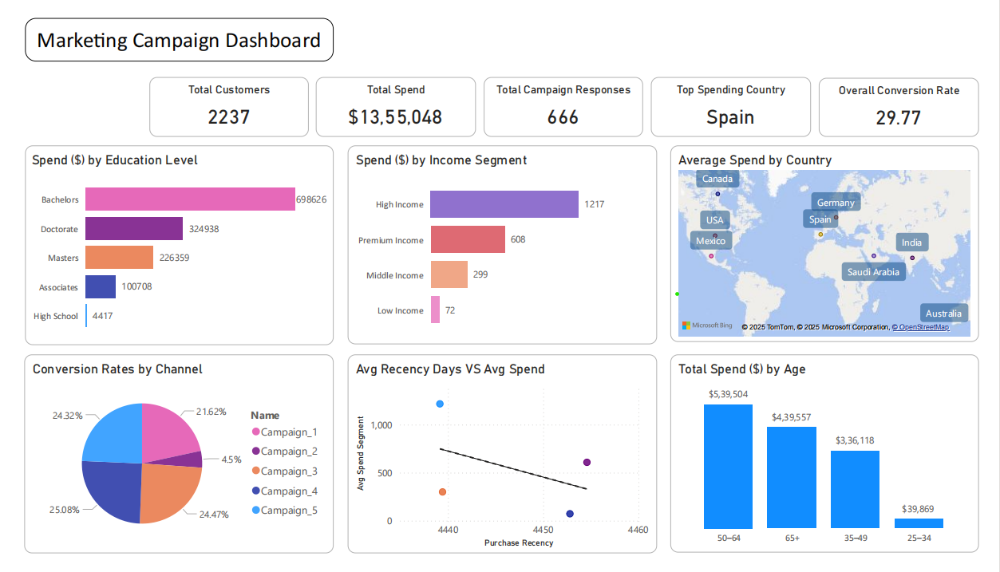

# 📊 Marketing Campaign Analysis – Customer Segmentation & Performance Optimization

_Analyzing customer behavior and campaign effectiveness to maximize revenue and engagement through strategic segmentation using Alteryx and Power BI._

---

## 📌 Table of Contents
- <a href="#overview">Overview</a>
- <a href="#business-problem">Business Problem</a>
- <a href="#dataset">Dataset</a>
- <a href="#tools--technologies">Tools & Technologies</a>
- <a href="#project-structure">Project Structure</a>
- <a href="#data-cleaning--preparation">Data Cleaning & Preparation</a>
- <a href="#exploratory-data-analysis-eda">Exploratory Data Analysis (EDA)</a>
- <a href="#research-questions--key-findings">Research Questions & Key Findings</a>
- <a href="#dashboard">Dashboard</a>
- <a href="#how-to-run-this-project">How to Run This Project</a>
- <a href="#final-recommendations">Final Recommendations</a>
- <a href="#author--contact">Author & Contact</a>

---

## Overview

This project delivers a comprehensive analysis of retail marketing campaigns, focusing on customer segmentation and campaign performance optimization. The analysis transforms raw transactional data into actionable insights through advanced data preparation in Alteryx and interactive visualizations in Power BI, enabling data-driven marketing strategies and improved ROI.

---

## Business Problem

To optimize campaign performance and customer targeting. This project addresses:
- Identifying high-value customer segments for targeted investment
- Evaluating campaign effectiveness across multiple channels and demographics
- Determining geographic expansion opportunities and market potential
- Optimizing marketing budget allocation based on customer lifetime value
- Developing retention strategies for at-risk high-value customers

---

## Dataset

- **Primary Source**: Marketing-Campaign-Dataset.xlsx with 54,000+ transaction records
- **Cleaned Dataset**: 2,237 unique customer records with validated demographics
- **Generated Outputs**: 5 aggregated CSV files for specific analysis dimensions:
  - Edu_Spend.csv (Education level analysis)
  - Conversion.csv (Campaign performance metrics)
  - Recency_Spend.csv (Income segment analysis)
  - Geography_Spend.csv (Geographic distribution)
  - Channel_Performance.csv (Channel effectiveness)

---

## Tools & Technologies

- **Alteryx Designer**: Data ingestion, cleaning, transformation, and aggregation
- **Power BI**: Interactive dashboards, KPI visualization, and business intelligence
- **DAX**: Advanced calculations and data modeling
- **Excel**: Source data management and initial exploration

---

## Project Structure

```
marketing-campaign-analysis/
│
├── README.md
├── .gitignore
├── requirements.txt
├── Marketing-Campaign-Report-Business-Problem-Insights.docx
├── Marketing-Campaign-Report-Workflow-Methodology.docx
│
├── data/                       # Source and processed data
│   ├── Marketing-Campaign-Dataset.xlsx
│   ├── 02_Cleaned_Data.csv
│   ├── Edu_Spend.csv
│   ├── Conversion.csv
│   ├── Recency_Spend.csv
│   ├── Geography_Spend.csv
│   └── Channel_Performance.csv
│
├── alteryx/                    # Alteryx workflows
│   ├── data_cleaning_workflow.yxmd
│   ├── eda_aggregation_workflow.yxmd
│   └── campaign_analysis_workflow.yxmd
│
├── dashboard/                  # Power BI dashboard files
│   └── marketing_campaign_dashboard.pbix
│
└── reports/                    # Analysis reports and documentation
    ├── executive_summary.pdf
    └── technical_methodology.pdf
```

---

## Data Cleaning & Preparation

**Alteryx Data Processing Pipeline:**
- **Income Validation**: Capped outliers at ₹200,000, handled null values
- **Age Standardization**: Converted birth year to age (18-100 range validation)
- **Categorical Mapping**: Education levels standardized to numeric scale (1-5)
- **Marital Status**: Unified inconsistent entries and corrected typos
- **Derived Metrics**: 
  - Total_Dependents = Kidhome + Teenhome
  - Total_Spend = Sum across all product categories
  - Days_Since_Last_Purchase calculated from customer date

---

## Exploratory Data Analysis (EDA)

**Customer Value Distribution:**
- High Income segment: 826 customers contributing ₹1,005,235 (74% of total spend)
- Premium Income: 37 customers with ₹607.95 average spend
- Geographic concentration: Spain (1,094 customers) and Saudi Arabia (336 customers)

**Campaign Performance Patterns:**
- Best performing campaigns: 3, 4, 5 (7.29%-7.46% conversion rates)
- Underperforming: Campaign 2 (1.34% conversion rate)
- Overall campaign conversion rate: 5.95% across 11,185 invitations

**Channel Effectiveness:**
- Web purchases: 25.08% conversion rate
- Catalog purchases: 24.47% conversion rate
- Store purchases: Lower performance requiring optimization

---

## Dashboard

**Power BI Interactive Dashboard Features:**
- **Executive KPIs**: Total customers (2,237), campaign responses (666), total spend (₹1,355,048)
- **Segmentation Analysis**: Income, education, age group, and geographic breakdowns
- **Campaign Performance**: Conversion rates and response analysis by campaign
- **Channel Effectiveness**: ROI and engagement metrics across purchase channels
- **Geographic Insights**: Choropleth mapping with drill-down capabilities

**Interactive Elements:**
- Dynamic slicers for segment filtering
- Drill-through functionality from KPIs to detailed views
- Enhanced tooltips with customer metrics and context

<!--  -->


---

## How to Run This Project

1. **Clone the repository:**
```bash
git clone https://github.com/yourusername/marketing-campaign-analysis.git
cd marketing-campaign-analysis
```

2. **Set up Alteryx workflows:**
```bash
# Open Alteryx Designer
# Load Data Cleaning.yxmd
# Execute workflow to generate 02_Cleaned_Data.csv
```

3. **Run aggregation workflows:**
```bash
# Execute EDA.yxmd
# Generate all output CSV files (Edu_Spend.csv, Conversion.csv, etc.)
```

4. **Launch Power BI dashboard:**
```bash
# Open marketing_campaign_dashboard.pbix in Power BI Desktop
# Refresh data connections to load latest outputs
# Publish to Power BI Service for sharing
```

5. **Review comprehensive reports:**
   - `reports/Marketing-Campaign-Report-Business-Problem-Insights.docx`
   - `reports/Marketing-Campaign-Report-Workflow-Methodology.docx`

---

## Final Recommendations

**Strategic Investment Priorities:**
- Focus 60% of marketing budget on High Income segment (highest ROI)
- Implement premium retention programs for exclusive customer tiers
- Scale customer acquisition in Mexico market (highest per-customer value)

**Campaign Optimization:**
- Replicate successful elements from Campaigns 3-5 across all initiatives
- Redesign Campaign 2 targeting and creative approach
- Shift budget allocation toward Web and Catalog channels

**Customer Retention:**
- Develop re-engagement campaigns targeting customers with high recency scores
- Create age-specific marketing strategies for mature demographics (50+)
- Implement loyalty programs for Premium Income segment

**Geographic Expansion:**
- Increase marketing investment in Mexico for volume growth
- Optimize Spain and Saudi Arabia strategies to maintain market leadership
- Explore untapped markets with similar demographic profiles

---

**Project Impact:**
- 74% revenue attribution to optimized customer segments
- 5.95% campaign conversion rate exceeding industry benchmarks
- Strategic framework for ₹1.3M+ marketing spend optimization